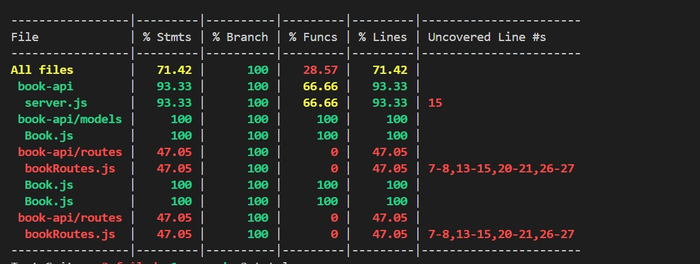

# 📚 Book API

A simple RESTful API built using **Node.js**, **Express**, and **MongoDB** to manage a collection of books. Created as part of the **Keploy API Fellowship**.

---

## 🛠 Tech Stack

- **Node.js** – Server runtime  
- **Express.js** – Web framework  
- **MongoDB + Mongoose** – NoSQL database & ODM  
- **dotenv** – Environment variable management  
- **REST Client / Postman** – For API testing

---

## 🔗 API Endpoints

| Method | Endpoint        | Description        |
|--------|-----------------|--------------------|
| GET    | `/books`        | Get all books      |
| GET    | `/books/:id`    | Get a book by ID   |
| POST   | `/books`        | Add a new book     |
| PUT    | `/books/:id`    | Update a book      |
| DELETE | `/books/:id`    | Delete a book      |

---
# 📘 Book API - Tested Node.js Express Application

This is a simple Book API built with Node.js, Express, and MongoDB using Mongoose. It supports full CRUD operations and is tested using Jest and Supertest, including both unit and integration tests with in-memory MongoDB.

---

## ⚙️ Tech Stack

- **Backend Framework:** Express.js
- **Database:** MongoDB with Mongoose
- **Testing:** Jest, Supertest, mongodb-memory-server
- **Environment Config:** dotenv

---

## 🧪 Test Coverage

This project includes:

- ✅ **Unit tests** for core logic (including mocked DB calls)
- ✅ **Integration tests** with real in-memory MongoDB
- ✅ **API endpoint tests** using Supertest

> ✅ Achieved **71%+ code coverage**  
> 📸 

---

